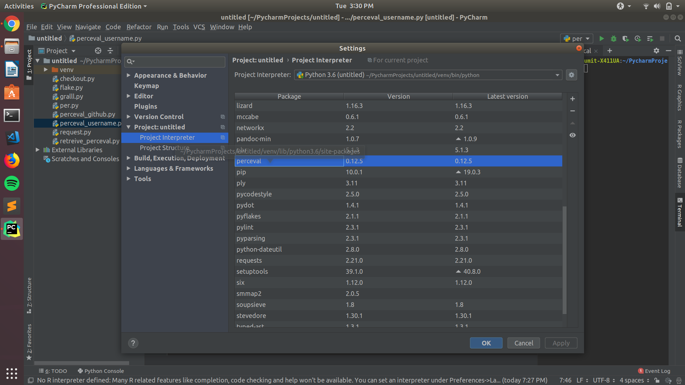
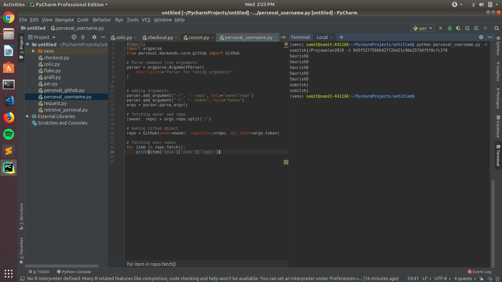
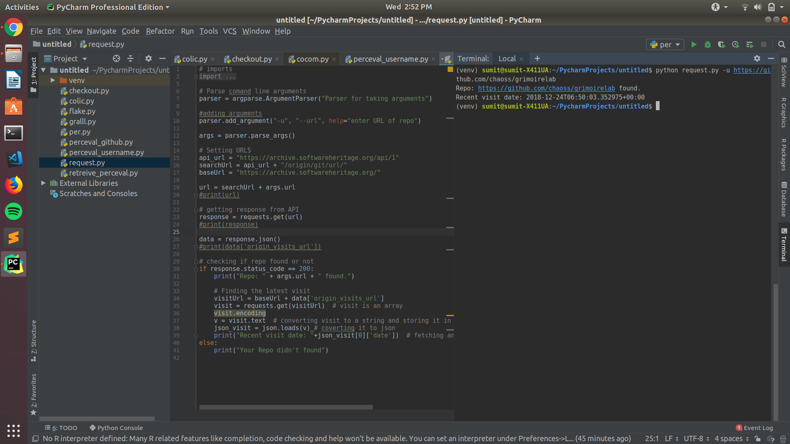
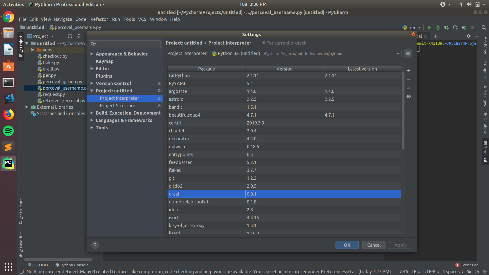
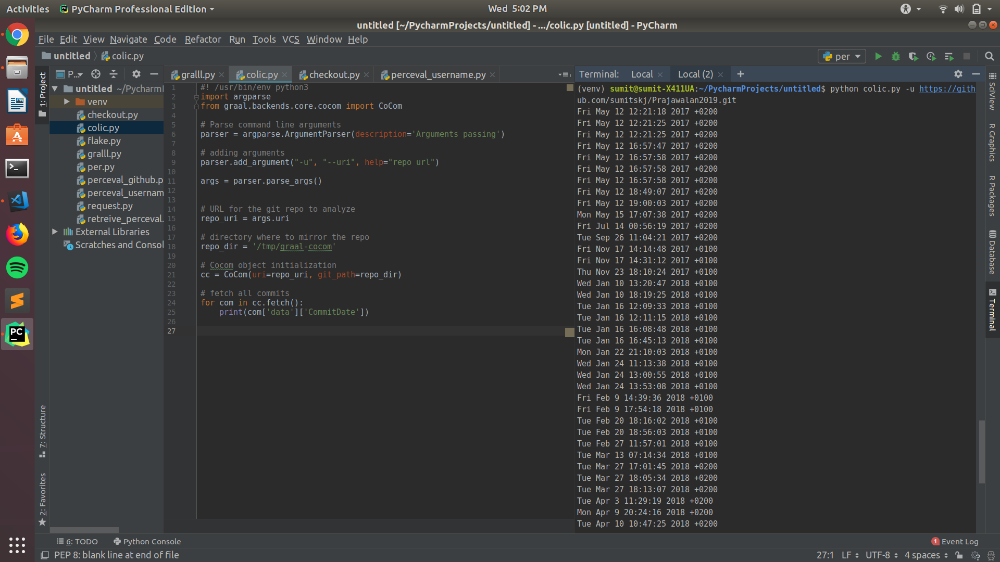
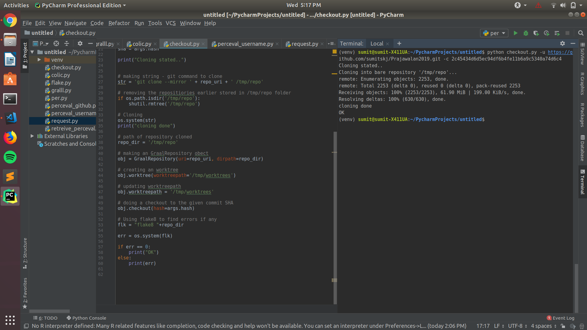

# GSOC-Chaoss
This repo is to show my work that I have done on Idea: [Support of Source Code Related Metrics](https://github.com/chaoss/grimoirelab/issues/182).   

My Solution for the Microtasks:

**Microtask 1:**

For mirotask 1, I have installed the perceval package on PyCharm. Now I can run perceval commands form PyCharm.

**Microtask 2:**

For Microtask 2, I have made the python script [Microtask 2](Microtask2.py). In this I have executed the Perceval using GitHub backend. 
The code on execution requires two arguments 1. Github repo as "owner/repo" 2. Github auth token (optinal argument).
The script on execution gives output the usernames of all the persons who made commit on the repo.

Example: python microtask2.py -r owner/repo -t XXXX

Output: 

**Microtask 3:** 

1.What is the meaning of the JSON attribute 'timestamp'? 
  The attribute 'timestamp' gives the date and time of the moment when the code got executed and gave us the information back. Timestamp is in 'epoch' format which can be converted into date and time. 

2.What is the meaning of the JSON attribute 'updated_on'? 
  This attribute shows the date and time of when was the repo got last updated. 

3.What is the meaning of the JSON attribute 'origin'? 
  It shows the link of from where the information of repo is fetched. It usually shows the git repo link. 
 
4.What is the meaning of the JSON attribute 'category'?
  It shows what type of operation was performed, usually it is a commit operation. 

5.What is the meaning of the JSON attribute 'uuid'? 
  It is a 128 bit unique number given to that operation. It is uaually universally unique. 

6.Which are the common methods of the Perceval backends? 
  Common methods of perceval backends are fetch(), fetch_items(), has_archiving(), has_resuming(), metadata_id(), metadata_category(), etc. 

7.List and explain at least 3 Git commands used by the Perceval backend (you can rely on the Git documentation) 
  Git commands used by Perceval backend are : 
  * clone() : 
    syntax : clone(cls, uri, dirpath) 
    This method clones the repo. Make a bare copy of the repository stored in `uri` into `dirpath`.
    The repository would be either local or remote. 
        :param uri: URI of the repository 
        :param dirtpath: directory where the repository will be cloned 
        :returns: a `GitRepository` class having cloned the repository 

  * count_objects(): 
    syntax : count_objects(self) 
    Count the objects of a repository.
    The method returns the total number of objects (packed and unpacked) available on the repository 

  * update() : 
    syntax : update(self) 
    Update repository from its remote. Calling this method, the repository will be synchronized with the remote repository using 'fetch' command for 'heads' refs. Any commit stored in the local copy will be removed; refs will be overwritten. 

  * sync() :  
    syntax : sync(self) 
    Keep the repository in sync. This method will synchronize the repository with its 'origin', fetching newest objects and updating references. It uses low level commands which allow to keep track of which things    have changed in the repository. The method also returns a list of hashes related to the new commits fetched during the process. It returns a list of new commits 

**Microtask 4:** 

For Microtask 4, I have made the python script [Microtask 4](Microtask4.py). This script finds if an given GitHub repo is on the Showheritage or not and also shows the date of last visit.

The script on execution first takes github repo url as an argument, then it uses the Showheritage API to check if repo is there or not. For this request module is used which makes an GET request on the API. The endpoint used on Showheitage API for finding repo is: "/api/1/origin/(origin_type)/url/(origin_url)/". After getting the reponse, we check is an stautus code 200 is retreived or not if not then repo is not present at showheritage otherwise we now finds its last visit. In the response got earlier we get an entry of "origin_visits_url" which has all the entries of the date when it has been visited. Now we again make an get request on the showheritage API by using the "origin_visits_url" and from the response we jsut show the first entry which is the latest visit date and time.

Base API url: "https://archive.softwareheritage.org/" 
Finding repo url (origin endpoint): "https://archive.softwareheritage.org"+"/api/1/origin/(origin_type)/url/(origin_url)/" 
Finding visits url (visit url) : "https://archive.softwareheritage.org" + "origin_visits_url"
 
Example: python microtask4.py -u "repo_url"
 
Output: 

**Microtask 5:** 

For mirotask 5, I have installed the graal package on PyCharm. Now I can run graal commands form PyCharm.

**Microtask 6:** 

For Microtask 6, I have made the python script [Microtask 6](Microtask6.py). In this I have executed Graal using Cocom backend. 
The code on execution requires argument the url of repo. The script on execution gives output the commit dates of all the commits on the repo.

Example: python microtask6.py -u "url"

Output: 

**Microtask 7:**
 

1.Which are the common methods of the Graal backends? 
  Common methods of Graal backends are fetch(), metadata_category(), analyze(), etc. 

2.List and explain at least 2 Git commands used by Graal (and not implemented in Perceval). 
  Git commands used by Graal are:  
  * worktree() : 
    syntax : worktree(self, worktreepath, branch=None): 
    Create a working tree of the cloned repository with the active branch set to `branch`. 
        :param worktreepath: the path where the working tree will be located 
        :param branch: the name of the branch. If None, the branch is set to `master` 
    
  * prune() : 
    syntax: prune(self):  
    Delete a working tree from disk. 
    :param worktreepath: directory where the working tree is located. 

  * checkout() : 
    syntax : checkout(self, hash): 
    Checkout a Git repository at a given commit. 
    :param hash: the hash of a commit 
  
**Microtask 8:**

For Microtask 8, I have made the python script [Microtask 8](Microtask8.py). This script takes the repo url and a commit SHA as inputs, then it clones that repo if it isn't there, then it checkouts to the given commit SHA and then finally performs an flake8 on that.

In the script, we first take the url and commit SHA as arguments, then we have to clone the repo which we will do by using the "git clone --mirror" command through the os moodule. Now to make a checkout to the given commit we have, first we have to create an GraalRepository object which takes parameters as repo url and cloned repo path and then we need to create an worktree for our repo about the commits and have to update worktree path. Then using this object we call GraalRepository checkout() method  which will checkout us to the certain commit. Then using the os module we will execute an flake8 on the repo.

Example: python checkout.py -u "url" -c "commit SHA"

Output:

