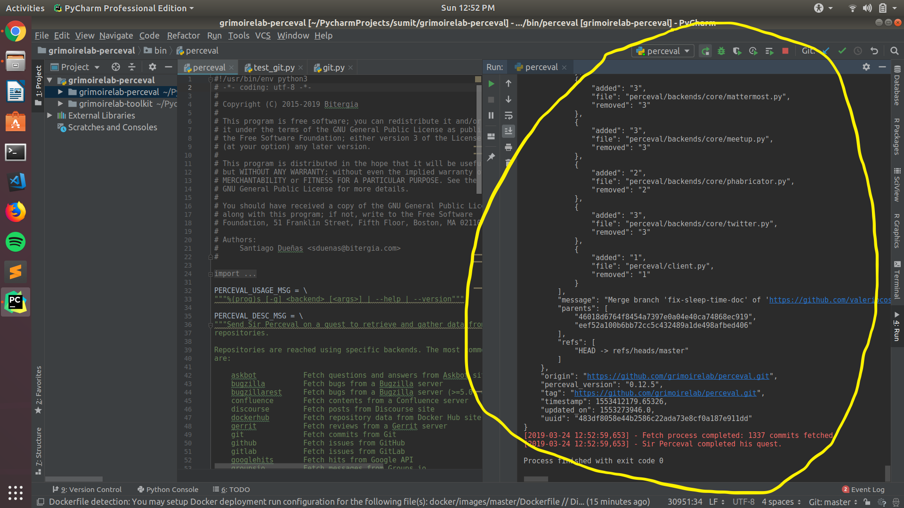

In this task I have cloned the [grimoirelab-perceval repo](https://github.com/chaoss/grimoirelab-perceval.git) and [grimoirelab-toolkit repo](https://github.com/chaoss/grimoirelab-toolkit.git). Then I opened the grimoirelab-perceval project in PyCharm and then went to Settings then to Project Structure then I clicked the + sign of Add Content Root, then browsed the grimoirelab-toolkit repo to select it.  
Now to run a perceval command I went to edit configurations in Run, then I added the script path to the percevals repo to /bin/perceval. Then added parameters and saved the configurations. Then we run the script which gives us the output.
 
**Project Setup:** 

 

 

**Running perceval:** 

