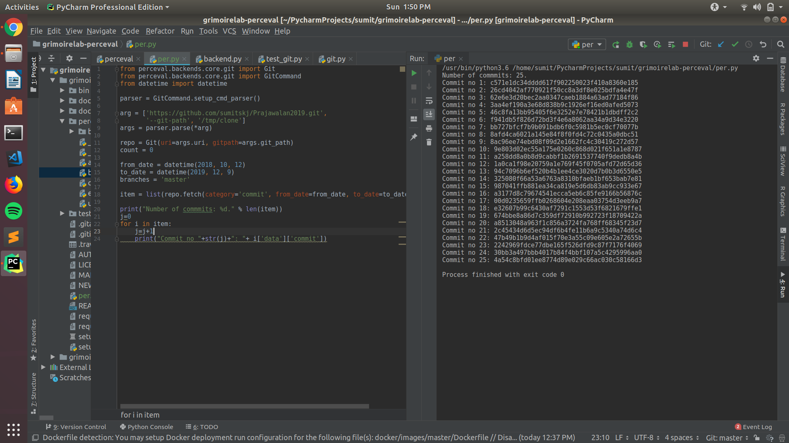
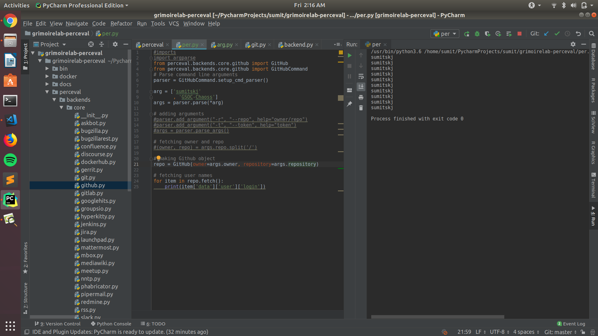

For Microtask 2, I have made the python script [git-backend](git-backend.py). In this I have executed the Perceval using GitHub backend. 
The code on execution requires two arguments 1. Github repo as "owner/repo" 2. Github auth token (optinal argument).
The script on execution gives output the usernames of all the persons who made commit on the repo.
<br />

Output: <br />
Using Git Backend:<br />
Command : ```python git-backend.py```


<br />

Using Github Backend: <br />
Command : ```python github-backend.py```



<br />

