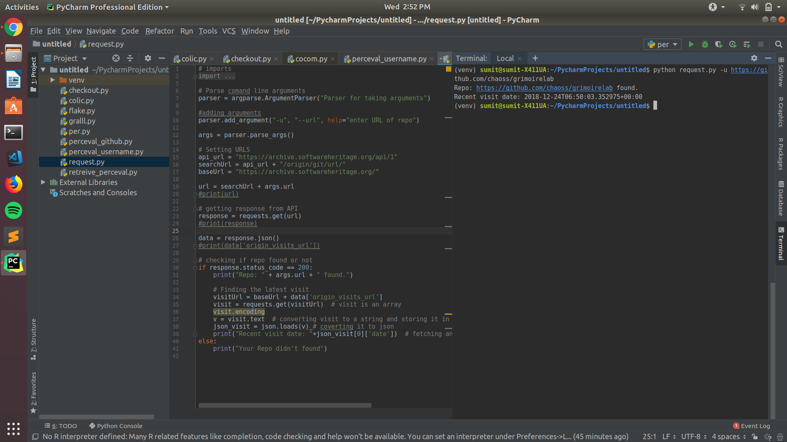

For Microtask 4, I have made the python script [Microtask 4](Microtask4.py). This script finds if an given GitHub repo is on the SoftwareHeritage or not and also shows the date of last visit.

The script on execution first takes github repo url as an argument, then it uses the SoftwareHeritage API to check if repo is there or not. For this request module is used which makes an GET request on the API. The endpoint used on SoftwareHeritage API for finding repo is: "/api/1/origin/(origin_type)/url/(origin_url)/". After getting the reponse, we check is an stautus code 200 is retreived or not if not then repo is not present at SoftwareHeritage otherwise we now finds its last visit. In the response got earlier we get an entry of "origin_visits_url" which has all the entries of the date when it has been visited. Now we again make an get request on the SoftwareHeritage API by using the "origin_visits_url" and from the response we jsut show the first entry which is the latest visit date and time.

Base API url: "https://archive.softwareheritage.org/" 
Finding repo url (origin endpoint): "https://archive.softwareheritage.org"+"/api/1/origin/(origin_type)/url/(origin_url)/" 
Finding visits url (visit url) : "https://archive.softwareheritage.org" + "origin_visits_url"
 
Example: python microtask4.py -u "repo_url"
 
Output: 
