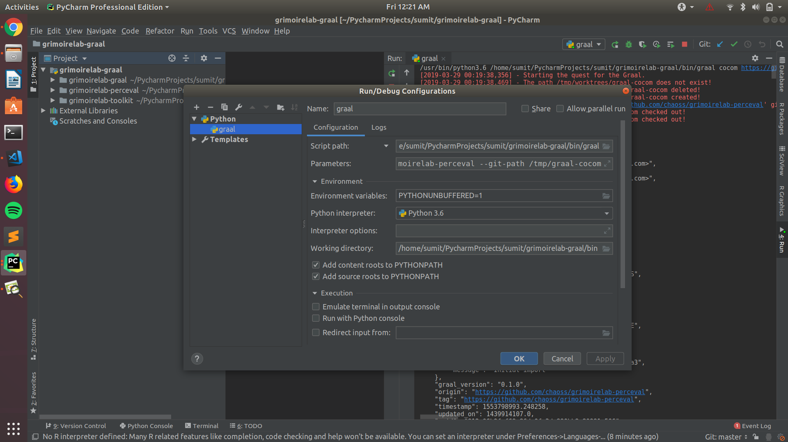
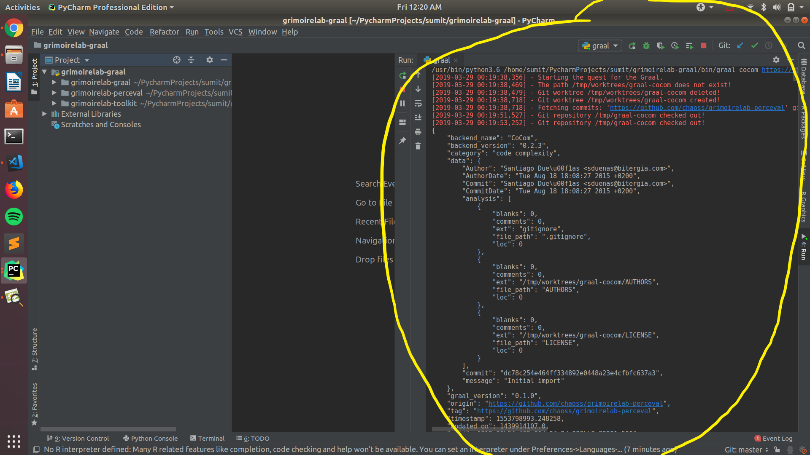

In this task I have cloned the[grimoirelab-graal repo](https://github.com/chaoss/grimoirelab-graal.git), [grimoirelab-perceval repo](https://github.com/chaoss/grimoirelab-perceval.git) and [grimoirelab-toolkit repo](https://github.com/chaoss/grimoirelab-toolkit.git). Then I opened the grimoirelab-graal project in PyCharm and then went to Settings then to Project Structure then I clicked the + sign of Add Content Root, then browsed the grimoirelab-toolkit repo and grimoirelab-perceval to select it.  
Now to run a graal command I went to edit configurations in Run, then I added the script path to the percevals repo to /bin/graal. Then added parameters and saved the configurations. Then we run the script which gives us the output.
 
Project Setup:

 
Running graal:

