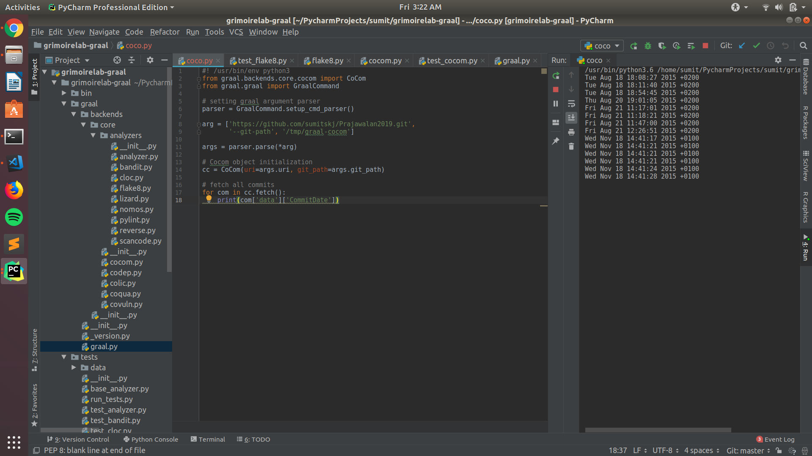
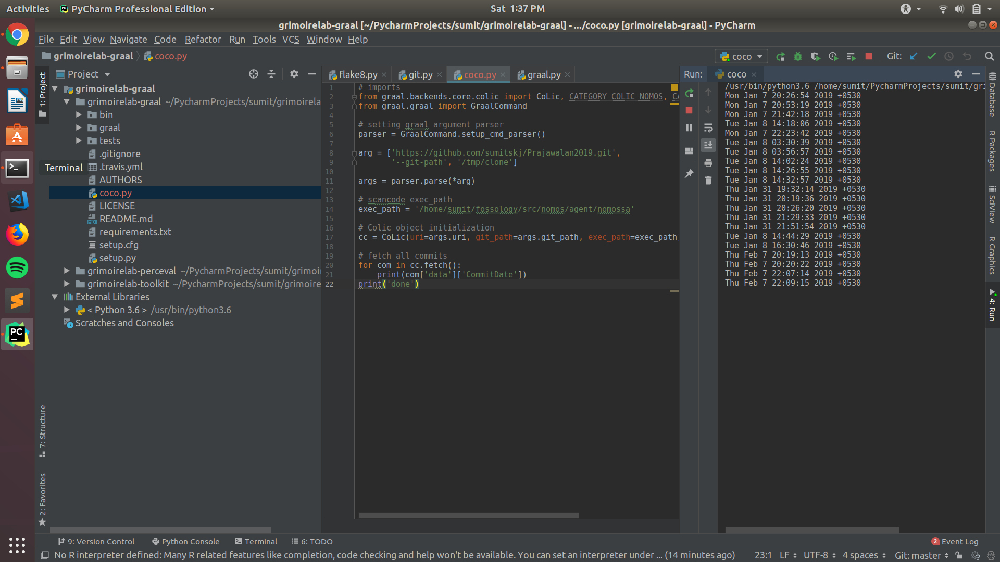

For Microtask 6, I have made the python script for cocom-backend [Cocom](cocom-backend.py) and for CoLic backend [CoLic](colic-backend.py) . In this I have executed Graal using Cocom backend and CoLic backend. The script on execution gives output the commit dates of all the commits on the repo.

**Example:** 
**Cocom Backend:**<br />
**Comand:** ```python cocom-backend.py```

**Output:** <br />
<br />

**CoLic Backend:** <br />

* For using CoLic you have to first have [Nomos](https://github.com/chaoss/grimoirelab-graal) or [Scancode](https://github.com/chaoss/grimoirelab-graal) backends.

**Command :** ```python colic-backend.py```
<br />
  

**Output:** <br />
