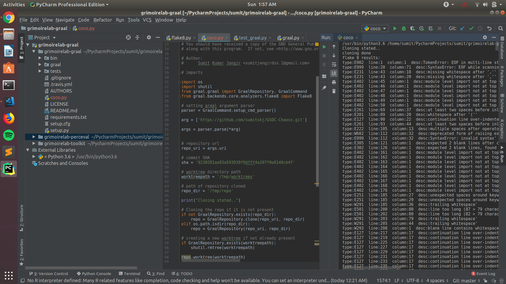

For Microtask 8, I have made the python script [Microtask 8](microtask8.py). This script takes the repo url and a commit SHA as inputs, then it clones that repo if it isn't there, then it checkouts to the given commit SHA and then finally performs an flake8 on that.

In the script, we first take the url and commit SHA as arguments, then we have to clone the repository if it is not already present, which we will do by using the GraalRepositories methods. Now we will also have to create an worktree for the repository. Then using this object we call GraalRepository checkout() method  which will checkout us to the certain commit. Then using the Flake8 analyser we will find if there are some errors or warning in the directory.
<br /><br />

**Command:** ```python checkout.py```
<br /><br />

**Output:**
<br />

